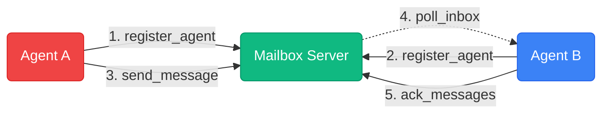

# Agent Mailbox MCP

Agent Mailbox MCP is a lightweight message bus for Codex and Claude Code. Agents register, send messages, poll inboxes, and acknowledge delivery. Built from scratch with and tested with both.



## Security defaults

- `mTLS` is enabled by default (`MAILBOX_REQUIRE_MTLS=true`).
- Tokens are auto-generated on first startup when `tokens.local.json` is missing.
- Generated server token file stores `token_hash` (not plaintext bearer tokens).
- Plaintext bootstrap tokens are written once to `tokens.local.secrets.json`.
- Every token has `expires_at` and optional `revoked` state.
- Token file is reloaded periodically (`MAILBOX_TOKEN_RELOAD_INTERVAL`) so revokes/rotations apply without restart.

## Quick start (Windows)

```powershell
.\scripts\start-postgres.ps1
Copy-Item .env.example .env
.\scripts\run-dev.ps1
```

On first run, the server creates:

- `tokens.local.json` (hashes + metadata)
- `tokens.local.secrets.json` (plaintext bearer tokens to use in clients)

In a second shell:

```powershell
.\scripts\smoke.ps1
```

## Run modes

HTTP mode:

```powershell
.\scripts\run-dev.ps1
```

STDIO mode:

```powershell
$env:MAILBOX_TOKEN = "<token-from-tokens.local.secrets.json>"
.\scripts\run-stdio.ps1
```

## Configuration highlights

| Variable | Default | Description |
|---|---|---|
| `MAILBOX_REQUIRE_MTLS` | `true` | Require client cert authentication |
| `MAILBOX_TOKENS_JSON_FILE` | `tokens.local.json` | Token metadata file (hashed tokens) |
| `MAILBOX_BOOTSTRAP_TOKENS_FILE` | `tokens.local.secrets.json` | One-time plaintext token output |
| `MAILBOX_BOOTSTRAP_TOKEN_TTL` | `24h` | TTL for auto-generated tokens |
| `MAILBOX_TOKEN_RELOAD_INTERVAL` | `15s` | Token file reload interval for revoke/rotate |
| `MAILBOX_ALLOW_PLAINTEXT_TOKENS` | `false` | Only set `true` for migration from legacy token files |

## Token file format

```json
{
  "tokens": [
    {
      "id": "bootstrap-1",
      "token_hash": "sha256:...",
      "team_id": "dev-team",
      "subject": "bootstrap-1",
      "scopes": ["send:direct", "poll:self", "list:agents"],
      "created_at": "2026-02-21T00:00:00Z",
      "expires_at": "2026-02-22T00:00:00Z",
      "revoked": false
    }
  ]
}
```

`scopes` must be explicit and non-empty.

If you use optional tools, add matching scopes:
- `cancel_message`: `send:any` or `send:direct` or `send:broadcast` (or `*`)
- `set_agent_status`: `status:write` (or `*`)
- `get_message_log`: `log:read` (or `*`)

## Docs

Detailed setup and troubleshooting: [`docs/INSTALL.md`](docs/INSTALL.md)
